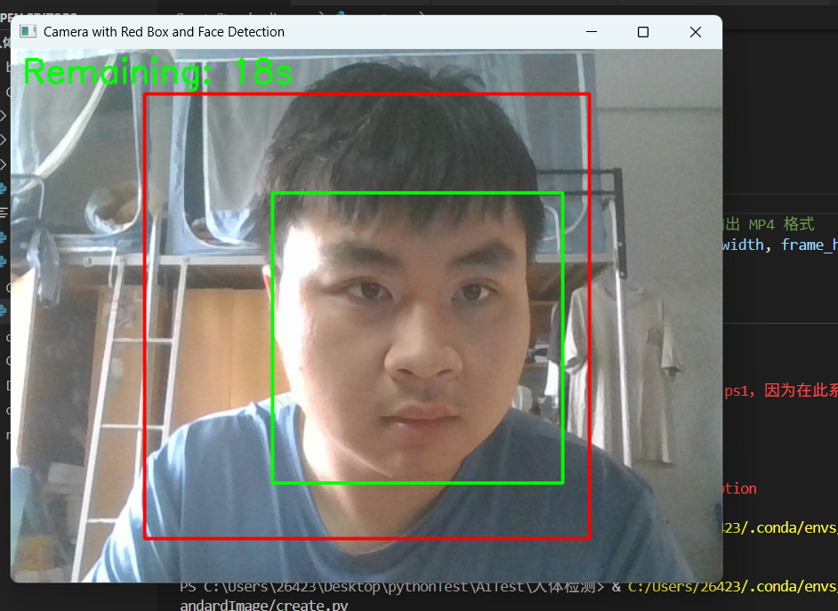
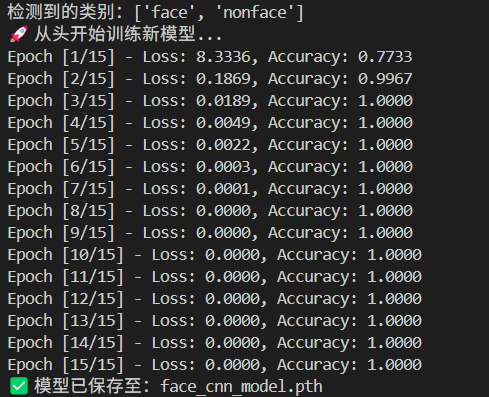
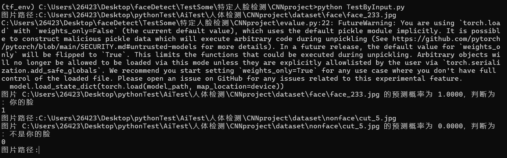

# 通过CNN实现简单的特定人脸识别

## 0 硬件要求

### 基本要求

最后制作的模型大小就1Mb，CPU就能跑。

电脑具有摄像头

python环境

### 部署环境

我使用的是Python 3.8.18 (default, Sep 11 2023, 13:47:48) [MSC v.1916 64 bit (AMD64)] :: Anaconda,

```
#安装环境包
pip install -r requirements.txt
```

### 项目文件结构

```
特定人脸检测
    │  CreateNonFaceData.py
    │  DetectManData.py
    │  vedioback.mp4
    │
    ├─background_cuts_from_video
    ├─CNNproject
    │  │  evalue.py
    │  │  face_cnn_model.pth
    │  │  model.py
    │  │  tainCNN.py
    │  │  TestByInput.py
    │  │
    │  ├─dataset
    │  │  ├─face
    │  │  └─nonface
    │  ├─detected_faces
    │  └─__pycache__
    │          evalue.cpython-38.pyc
    │          model.cpython-38.pyc
    │
    ├─CreateStandardImage
    │      create.py
    │
    └─detected_faces
```

## 1 制作数据集

### 1.1.1 制作要识别的人脸信息

CreateStandardImage\create.py 

**目的：**收集有效的可以被正确收集的人脸信息

1. **打开电脑摄像头**，获取实时视频画面。
2. **在画面中央绘制一个红色矩形框**（400×400 像素，用于参考区域）。
3. 使用 OpenCV 的 **Haar 特征分类器检测人脸**，在检测到的人脸周围绘制 **绿色矩形框**。
4. 在左上角实时显示 **剩余录制时间（秒）**。
5. 将 **原始视频帧（不带任何矩形框）保存为 MP4 文件 `output.mp4`**。
6. 当录制时间达到设定的 `record_time`（默认 60秒）或用户按下 `q` 键时，程序结束。

```python
import cv2
import time

# 加载 OpenCV 人脸检测器
face_cascade = cv2.CascadeClassifier(cv2.data.haarcascades + 'haarcascade_frontalface_default.xml')

# 打开默认摄像头
cap = cv2.VideoCapture(0)

# 获取摄像头图像的宽高
frame_width = int(cap.get(3))
frame_height = int(cap.get(4))

# 设置输出视频参数（不带红框，MP4格式）
fourcc = cv2.VideoWriter_fourcc(*'mp4v')  # 改为 'mp4v' 输出 MP4 格式
out = cv2.VideoWriter('output.mp4', fourcc, 20.0, (frame_width, frame_height))

# 定义红色矩形框大小（以画面中心为中心）
box_width, box_height = 400, 400

# 设置录制时长（秒）
record_time = 60  # 录制秒

# 获取当前时间（开始时间）
start_time = time.time()

while True:
    ret, frame = cap.read()
    if not ret:
        break

    # 获取当前时间并计算已录制时长
    elapsed_time = time.time() - start_time
    remaining_time = int(record_time - elapsed_time)  # 计算剩余时间（秒）
    
    if remaining_time <= 0:
        break  # 超过录制时长后退出

    # 转为灰度图像用于人脸检测
    gray = cv2.cvtColor(frame, cv2.COLOR_BGR2GRAY)

    # 使用人脸检测器检测人脸
    faces = face_cascade.detectMultiScale(gray, 1.1, 4)

    # 保存不带框的视频
    out.write(frame.copy())

    # ===== 显示用帧（加红框和人脸检测框） =====
    display_frame = frame.copy()

    # 画红色矩形框（居中）
    center_x, center_y = frame_width // 2, frame_height // 2
    x1 = center_x - box_width // 2
    y1 = center_y - box_height // 2
    x2 = center_x + box_width // 2
    y2 = center_y + box_height // 2
    cv2.rectangle(display_frame, (x1, y1), (x2, y2), (0, 0, 255), 2)  # 红色矩形框

    # 在每一张检测到人脸的区域画绿色矩形框
    for (x, y, w, h) in faces:
        cv2.rectangle(display_frame, (x, y), (x + w, y + h), (0, 255, 0), 2)  # 绿色矩形框

    # 显示剩余时间
    font = cv2.FONT_HERSHEY_SIMPLEX
    cv2.putText(display_frame, f'Remaining: {remaining_time}s', (10, 30), font, 1, (0, 255, 0), 2)

    # 显示视频窗口
    cv2.imshow('Camera with Red Box and Face Detection', display_frame)

    # 按 q 退出
    if cv2.waitKey(1) & 0xFF == ord('q'):
        break

# 释放资源
cap.release()
out.release()
cv2.destroyAllWindows()

print(f"录制完成，已保存为 output.mp4")
```

**效果**



制作完毕后得到output.mp4，根据绿色框框出现的情况，可以大体知道我们能收集到多少人脸有效的信息。

### 1.1.2 将视频转换为适合用于训练的数据集。

DetectManData.py

**目的**：将视频中的人脸信息转换为适合用于训练的数据集。

**加载人脸检测器**：使用 OpenCV 自带的 `haarcascade_frontalface_default.xml` 模型来检测视频中的人脸。

**读取视频**：通过 `cv2.VideoCapture` 打开并读取视频文件。

**创建输出文件夹**：如果指定的文件夹（`detected_faces`）不存在，会自动创建。

**从视频帧中检测人脸**：逐帧处理视频，转换为灰度图像，并通过 `detectMultiScale` 方法检测其中的人脸。

**筛选和保存人脸**：对于每一帧中检测到的人脸，如果它们的宽高大于 **200x200**（目的就是筛选出人脸），就将其提取出来并调整为 **50x50** 的尺寸，然后保存为 JPEG 文件。保存的文件名从 `face_20.jpg` 开始（由 `start_index` 控制），直到保存到指定数量（`target_face_count`）的图像。

**退出条件**：当保存的人脸数量达到预定的目标数量后，脚本停止处理并退出。

收集300个数据。

```python
import cv2
import os

# 加载 OpenCV 人脸检测器
face_cascade = cv2.CascadeClassifier(cv2.data.haarcascades + 'haarcascade_frontalface_default.xml')

# 输入视频文件路径
video_path = 'output.mp4'  # 你的视频路径
cap = cv2.VideoCapture(video_path)

# 创建输出文件夹
output_folder = 'detected_faces'
os.makedirs(output_folder, exist_ok=True)

# 设置起始编号和目标保存数量
start_index = 0  # ✅ 从第几张图片开始命名
target_face_count = 300  # ✅ 想保存多少张人脸

frame_count = 0
saved_count = 0

while cap.isOpened() and saved_count < target_face_count:
    ret, frame = cap.read()
    if not ret:
        break

    gray = cv2.cvtColor(frame, cv2.COLOR_BGR2GRAY)

    # 检测人脸
    faces = face_cascade.detectMultiScale(gray, scaleFactor=1.1, minNeighbors=5, minSize=(50, 50))

    for i, (fx, fy, fw, fh) in enumerate(faces):
        if fw >200 and fh > 200:
            face_img = frame[fy:fy+fh, fx:fx+fw]
            fixed_size_face = cv2.resize(face_img, (50, 50))

            # 使用 start_index 生成文件名
            face_filename = os.path.join(output_folder, f"face_{start_index + saved_count}.jpg")
            cv2.imwrite(face_filename, fixed_size_face)
            saved_count += 1

            # 达到目标数量后退出
            if saved_count >= target_face_count:
                break

    frame_count += 1

cap.release()
cv2.destroyAllWindows()

print(f"共保存了 {saved_count} 张人脸图像，保存至文件夹：{output_folder}，编号从 face_{start_index}.jpg 开始")
```

### 1.2 **制作用于非特定人脸的数据集**

CreateNonFaceData.py

**目的**：制作用于非特定人脸的数据集

1. 输入处理：
   - 读取名为"vedioback.mp4"的视频文件
   - 创建输出文件夹"background_cuts_from_video"
2. 裁剪逻辑：
   - 从视频的每一帧中，以50像素为步长（水平和垂直方向）提取50x50像素的小图像块
   - 确保不会超出图像边界
3. 输出控制：
   - 从指定的起始编号开始保存（默认从cut_0.jpg开始）
   - 最多保存300张图像（可调整target_count）
   - 图像命名为cut_XXX.jpg格式，保存在指定文件夹中
4. 终止条件：
   - 达到目标数量(300张)或视频结束即停止处理

最终输出：在指定文件夹中生成一系列50x50像素的小图像，用于后续处理或作为背景素材。

```python
import cv2
import os

# 输入视频文件路径
video_path = 'vedioback.mp4'  # 替换为你的视频路径
cap = cv2.VideoCapture(video_path)

# 创建输出文件夹
output_folder = 'background_cuts_from_video'
os.makedirs(output_folder, exist_ok=True)

# ✅ 设置起始编号和目标数量
start_index = 0  # 从 cut_501.jpg 开始编号
target_count = 300  # 要保存的图像总数

frame_count = 0
cut_count = 0

while cap.isOpened() and cut_count < target_count:
    ret, frame = cap.read()
    if not ret:
        break

    height, width, _ = frame.shape

    for y in range(0, height, 50):
        for x in range(0, width, 50):
            if x + 50 <= width and y + 50 <= height:
                cut_img = frame[y:y+50, x:x+50]

                # 保存图像，编号从 start_index 开始
                cut_filename = os.path.join(output_folder, f"cut_{start_index + cut_count}.jpg")
                cv2.imwrite(cut_filename, cut_img)
                cut_count += 1

                if cut_count >= target_count:
                    break
        if cut_count >= target_count:
            break

    frame_count += 1

cap.release()
cv2.destroyAllWindows()

print(f"裁剪完成，共生成 {cut_count} 张图像，编号从 cut_{start_index}.jpg 开始，保存至文件夹：{output_folder}")
```

## 2 制作模型

### 2.1 设计模型

CNNproject\model.py

**目的**：有模型才能训练

不懂的就去找相关资料，学习卷积神经网络

```python
# 简单 CNN 模型
import torch
import torch.nn as nn
class FaceCNN(nn.Module):
    def __init__(self):
        super(FaceCNN, self).__init__()
        self.conv = nn.Sequential(
            nn.Conv2d(1, 16, kernel_size=3, padding=1),
            nn.ReLU(),
            nn.MaxPool2d(2),  # 25x25
            nn.Conv2d(16, 32, kernel_size=3, padding=1),
            nn.ReLU(),
            nn.MaxPool2d(2),  # 12x12
            nn.Conv2d(32, 64, kernel_size=3, padding=1),
            nn.ReLU(),
            nn.MaxPool2d(2),  # 6x6
        )
        self.fc = nn.Sequential(
            nn.Flatten(),
            nn.Linear(64 * 6 * 6, 128),
            nn.ReLU(),
            nn.Linear(128, 2)  # 输出两个类
        )

    def forward(self, x):
        x = self.conv(x)
        x = self.fc(x)
        return x

#mo = FaceCNN()

# from torchinfo import summary
# summary(mo, input_size=(1, 1, 50, 50))  # 注意 batch_size=1
```

### 2.2  把之前制作的数据集放入对于文件夹

要特定识别的数据集，就放入CNNproject\dataset\face

非特定识别的数据集，就放入CNNproject\dataset\nonface【注意，除了特定人脸，其他人的人脸的数据集（也能通过1.1收集）也能放入这个数据集】

## 3 训练模型

tainCNN.py

**目的**：训练模型，制作出可以识别特定人脸的模型

1. **数据预处理**
   - 将输入图像统一转为 **灰度图**（`Grayscale`）。
   - 调整尺寸为 **50×50**（`Resize`）。
   - 转换为PyTorch张量（`ToTensor`）。
2. **数据集加载**
   - 从 `dataset_path` 文件夹读取数据，自动根据子文件夹名生成类别标签（如 `["class0", "class1"]`）。
   - 使用 `DataLoader` 分批次加载数据（`batch_size=32`），支持随机打乱（`shuffle=True`）。
3. **模型训练**
   - 使用自定义的 `FaceCNN` 模型（一个简单的3层CNN，输出2分类结果）。
   - 支持 **从已有模型继续训练**（`load_model=True`时加载 `face_cnn_model.pth`）。
   - 优化器为 **Adam**，损失函数为 **交叉熵损失**（`CrossEntropyLoss`）。
   - 每轮（epoch）统计 **总损失** 和 **分类准确率**，并打印日志。
4. **模型保存**
   - 训练完成后，将模型参数保存到 `face_cnn_model.pth`。

```python
import torch
import torch.nn as nn
import torch.optim as optim
from torchvision import datasets, transforms
from torch.utils.data import DataLoader
import os
from model import FaceCNN


def train_model(
    dataset_path='dataset',
    model_path='face_cnn_model.pth',
    load_model=False,
    batch_size=32,
    num_epochs=10,
    learning_rate=0.001,
    image_size=50
):
    # 图像预处理
    transform = transforms.Compose([
        transforms.Grayscale(num_output_channels=1),
        transforms.Resize((image_size, image_size)),
        transforms.ToTensor()
    ])

    # 加载数据集
    dataset = datasets.ImageFolder(root=dataset_path, transform=transform)
    data_loader = DataLoader(dataset, batch_size=batch_size, shuffle=True)

    print(f"检测到的类别：{dataset.classes}")

    # 模型、损失、优化器
    device = torch.device('cuda' if torch.cuda.is_available() else 'cpu')
    model = FaceCNN().to(device)
    if load_model and os.path.exists(model_path):
        model.load_state_dict(torch.load(model_path, map_location=device))
        print(f"✅ 成功加载模型参数：{model_path}")
    else:
        print("🚀 从头开始训练新模型...")

    criterion = nn.CrossEntropyLoss()
    optimizer = optim.Adam(model.parameters(), lr=learning_rate)

    # 训练过程
    for epoch in range(num_epochs):
        model.train()
        total_loss, correct, total = 0, 0, 0

        for images, labels in data_loader:
            images, labels = images.to(device), labels.to(device)

            outputs = model(images)
            loss = criterion(outputs, labels)

            optimizer.zero_grad()
            loss.backward()
            optimizer.step()

            total_loss += loss.item()
            _, predicted = outputs.max(1)
            correct += (predicted == labels).sum().item()
            total += labels.size(0)

        acc = correct / total
        print(f"Epoch [{epoch+1}/{num_epochs}] - Loss: {total_loss:.4f}, Accuracy: {acc:.4f}")

    # 保存模型
    torch.save(model.state_dict(), model_path)
    print(f"✅ 模型已保存至：{model_path}")

# 示例调用：
if __name__ == '__main__':
    train_model(load_model=True,num_epochs=60)  # 如果要加载已有模型接着训练，改为 load_model=True
```

**效果**



## 4 检验模型

evalue.py

目的：封装方法，更便捷使用模型功能

1. **模型加载**
   - 自动检测GPU/CPU设备，加载预训练的`FaceCNN`模型（你之前定义的50×50灰度图CNN）。
   - 从`model_path`加载训练好的权重参数，并切换到评估模式（`model.eval()`）。
2. **图像预处理**
   - 将输入图像转为灰度图，统一缩放到50×50尺寸，转换为PyTorch张量。
   - 添加batch维度（`unsqueeze(0)`）适配模型输入要求 `[1, 1, 50, 50]`。
3. **推理预测**
   - 使用`torch.no_grad()`禁用梯度计算，提升推理速度。
   - 模型输出通过`softmax`转为概率值，取索引0的概率作为"你的脸"的置信度。
   - 根据阈值（默认0.9）判断分类结果：
     - 概率≥阈值 → 判定为"你的脸"（返回1）
     - 否则 → 判定为"不是你的脸"（返回0）
4. **结果输出**
   - 打印预测概率和分类结果（如：`图片face_214.jpg 的预测概率为0.1234，判断为：不是你的脸`）。

```python
import torch
import torch.nn as nn
from torchvision import transforms
from PIL import Image
from model import FaceCNN  # 你之前定义的 CNN 模型

def predict_image(image_path, model_path='face_cnn_model.pth', image_size=50, threshold=0.9):
    # 图像预处理
    transform = transforms.Compose([
        transforms.Grayscale(num_output_channels=1),
        transforms.Resize((image_size, image_size)),
        transforms.ToTensor()
    ])

    # 加载图像
    image = Image.open(image_path)
    image = transform(image).unsqueeze(0)  # 加上 batch 维度 [1, 1, 50, 50]

    # 加载模型
    device = torch.device('cuda' if torch.cuda.is_available() else 'cpu')
    model = FaceCNN().to(device)
    model.load_state_dict(torch.load(model_path, map_location=device))
    model.eval()

    # 推理
    with torch.no_grad():
        image = image.to(device)
        output = model(image)
        probs = torch.softmax(output, dim=1)
        face_prob = probs[0][0].item()  # 假设索引0是“你的脸”

    # 判断是否是“你的脸”
    result = 1 if face_prob >= threshold else 0
    print(f"图片 {image_path} 的预测概率为 {face_prob:.4f}，判断为：{'你的脸' if result == 1 else '不是你的脸'}")
    return result


# 示例调用
if __name__ == '__main__':
    test_image = r'C:\Users\26423\Desktop\pythonTest\AiTest\人体检测\CNNproject\dataset\nonface\face_214.jpg'  # 替换为你的测试图片路径
    print(predict_image(test_image,threshold=0.95))
```

更方便的验证

TestByInput.py

```python
from evalue import predict_image

while True:
    test_image = input("图片路径:")
    print(predict_image(test_image,threshold=0.85))
```

**效果**



## 5 功能用途

### **🛠️ 应用场景**

1. **门禁/考勤系统**
   - 识别特定人员（如公司员工、家庭成员）。
2. **自动化设备控制**
   - 仅对目标用户响应（如个人电脑解锁、智能家居激活）。
3. **内容过滤**
   - 屏蔽非目标人脸的照片/视频（如儿童相册只保留父母出镜片段）。
4. **教育演示**
   - 学习PyTorch模型训练和OpenCV图像处理的完整流程。

### **⚡ 优势特点**

- **轻量化**：模型<1MB，适合嵌入式设备。
- **低依赖**：仅需OpenCV+PyTorch基础环境。
- **可定制**：通过调整数据集和阈值适配不同人脸。
- **自动化**：从数据采集到训练全流程脚本化。

------

### **📌 注意事项**

1. **光照/角度要求**
   - 训练数据应覆盖多种光照和姿态（如侧脸、戴眼镜等）。
2. **背景复杂度**
   - 简单背景（如白墙）下识别效果更佳。
3. **阈值调优**
   - 过高可能导致漏检，过低可能误检，需根据实际测试调整。

------

### **🚀 扩展方向**

- **增加数据增强**：训练时加入旋转、翻转提升鲁棒性。
- **实时摄像头检测**：结合OpenCV实现视频流实时识别。
- **多类别支持**：修改模型输出层，支持识别多个人。
